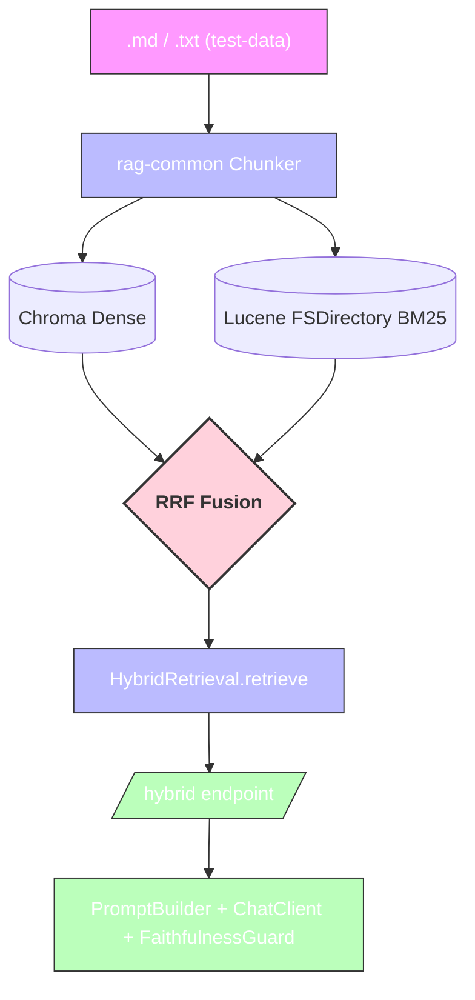

# rag-hybrid — Hybrid Search (BM25 + Dense via RRF)

## Diagram (Mermaid)

## Flow (steps 1-6 from build plan)

1. **Chunk** via `rag-common` (`Chunker.loadAndChunk`).
2. **Dense**: `vectorStore.similaritySearch` → Chroma.
3. **Lexical**: `QueryParser` → Lucene `FSDirectory` (`rag-hybrid/lucene-index`).
4. **RRF**: `HybridRetrieval.retrieve()` fuses ranked lists.
5. **Eval**: `HybridEval` runs `EvalHarness.pairs`.
6. **Generate/Guard**: `/hybrid` uses `rag-common` `PromptBuilder` + `FaithfulnessGuard`.
