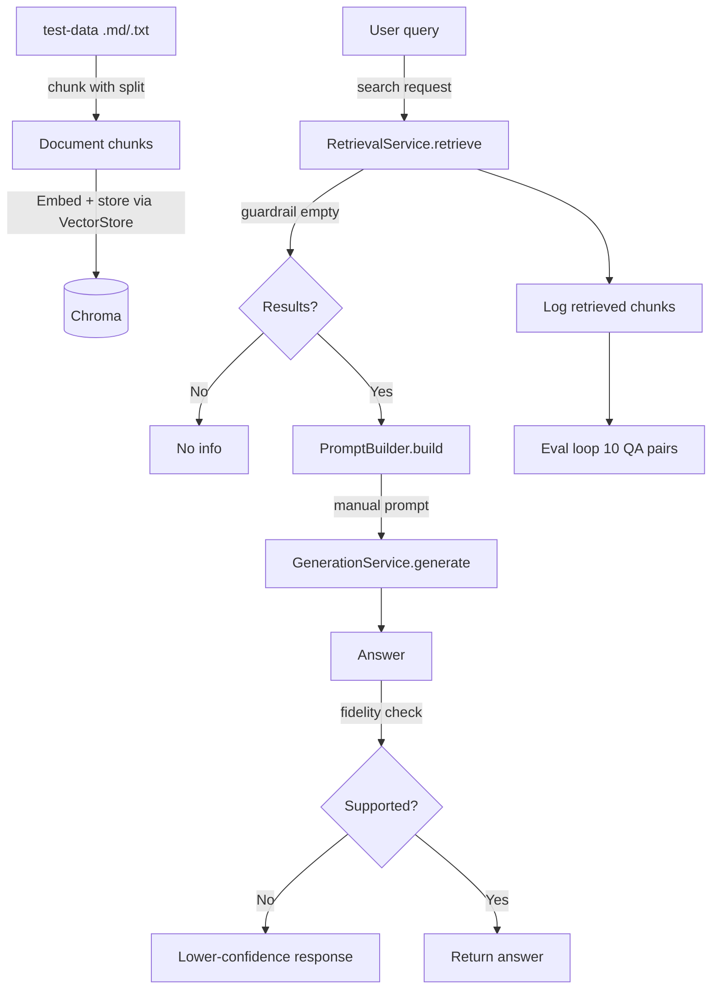

# rag-naive — Naive RAG Pipeline

Manual, visible steps (no `QuestionAnswerAdvisor` / `RetrievalAugmentationAdvisor`).

## Key files
- `DocumentLoaderService` / `Chunker` — load & split
- `EmbeddingStoreService` — `vectorStore.add()`
- `RetrievalService` — `SearchRequest` with threshold guardrail
- `PromptBuilderService` — manual prompt construction
- `GenerationService` — direct `chatClient.prompt()`
- `FaithfulnessGuardService` — output guardrail
- `EvalService` — regression eval loop
- `PipelineInitializer` — startup load + store + eval
